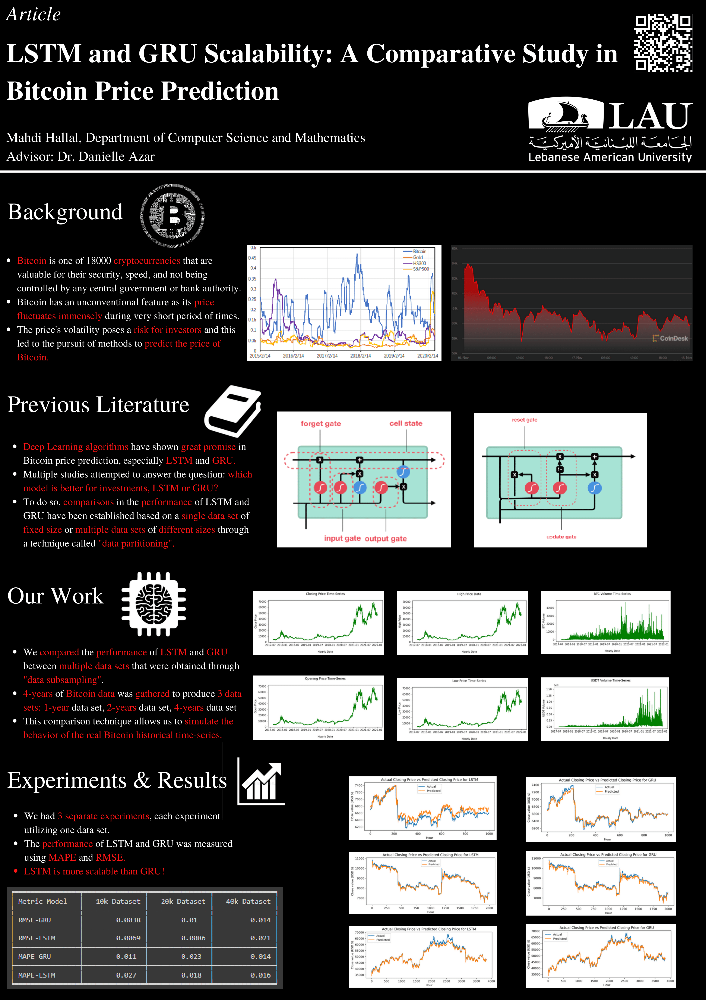

Bitcoin is the number one cryptocurrency in the world with a huge number of investors. It is the currency of the future; however, Bitcoin’s price fluctuates very frequently. This volatility of the cryptocurrency raises many concerns for all its investors as they can lose a lot of money if they do not follow an accurate and credible methodology in predicting the fluctuating price. Previous research has shown that various Deep Learning algorithms have great potential and accuracy in predicting the price of Bitcoin. The nature of this project is a research paper that is inspired by previous literature tackling the problem of Bitcoin price prediction. The research intends on comparing two of the best Deep Learning models in Bitcoin price prediction, LSTM and GRU. The two algorithms are going to be compared based on their accuracy in predicting Bitcoin price on the long run.

---

